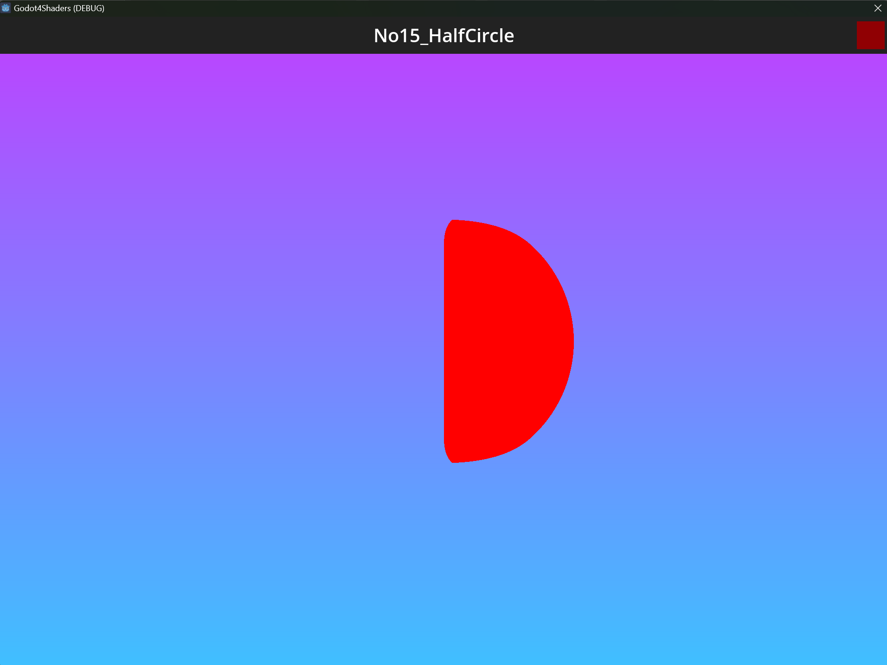
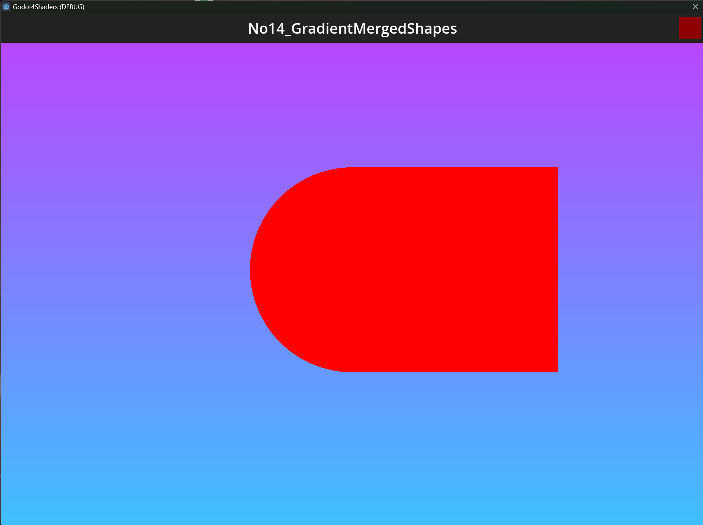

# Godot4 Shaders

web: https://gotm.io/lukinggames/godot4shaders

https://github.com/TechnoLukas/Godot4-Shaders
Here i will add and commit step by step procces of creating Godot shaders.

# FINISHED! 🎉

## Added on 06.5.2023

Added new shader (No15_HalfCircle)

shadertoy: https://www.shadertoy.com/view/dsdSD2

## Added on 05.5.2023

Added new shader (No14_GradientMergedShapes)

shadertoy: https://www.shadertoy.com/view/mddSD2

## Added on 03.5.2023

Added new shader (No13_GradientShapesCombine)

shadertoy: https://www.shadertoy.com/view/dddSD2

## Added on 01.5.2023

Added new shader (No12_ShapesCombine)

shadertoy: https://www.shadertoy.com/view/mdtSD2

## Added on 30.4.2023

Added new shader (No10_GradientChanging)

shadertoy: https://www.shadertoy.com/view/msdSW2

## Added on 26.4.2023

Added new shader (No10_GradientChanging)

shadertoy: https://www.shadertoy.com/view/msdXW2

## Added on 25.4.2023

Added new shader (No09_GradientWhiteBlack)

shadertoy: https://www.shadertoy.com/view/dsdXW2

## Added on 21.4.2023

Added new shader (No08_RedSquareFlying)

shadertoy: https://www.shadertoy.com/view/dddXW2

## Added on 17.4.2023

Added new shader (No07_RedSquareRotating)

shadertoy: https://www.shadertoy.com/view/mstXW2

## Added on 16.4.2023

Added new shader. (No06_RedSquare)

shadertoy: https://www.shadertoy.com/view/dstXW2

## Added on 15.4.2023

Added shader with mouse input (No02_WhiteRectMouse)

shadertoy -> https://www.shadertoy.com/view/dsdSW2

## Added on 13.4.2023

Added new shader called **No05_CircleColorSlidep**

shadertoy -> https://www.shadertoy.com/view/mdtXW2

## Added on 12.4.2023

Added new shader called **No04_ColorCirclePop** and resized text so long names can fit.

shadertoy -> https://www.shadertoy.com/view/ddtXW2

## Added on 6.4.2023

Scene Swicher

## Added on 4.4.2023

### No01_CircleBlur

Here is my first shader. 

shadertoy -> https://www.shadertoy.com/view/mddSW2

